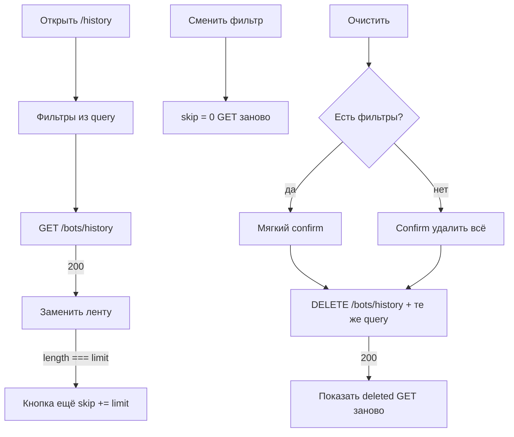

# История ботов

Страница: `/history` (редирект с `/bots/history`).  
Карточка бота на `/bots` открывает ту же ленту с `bot_id`.

Журнал событий **живых ботов**: старт, стоп, закрытие, пересбор сетки, исполнение ордера.  
Один бот — много строк. Всегда только события текущего пользователя.

Это **не** журнал попыток создания (`GET /bots/creation-history` на `/bots/create`).  
Это **не** WebSocket: WS обновляет список ботов, история в канал не пушится. После стопа / close / redeploy лента на карточке запрашивается заново.

## Потоки

## API

| Метод | Путь | Назначение |
|-------|------|------------|
| GET | `/bots/history` | лента событий |
| DELETE | `/bots/history` | удалить события (не ботов и не ордера) |

Query у GET и DELETE одинаковые, кроме пагинации (`skip` / `limit` только у GET).

| Параметр | Смысл |
|----------|--------|
| `bot_id` | один бот |
| `created_from` / `created_to` | границы `created_at`, ISO-8601 с таймзоной |
| `exchange` | `BINANCE` \| `BYBIT` \| `OKX` \| `OTHER` |
| `skip` / `limit` | пагинация GET, default `50`, max `500` |

Без фильтров GET — последние события по всем ботам. Без фильтров DELETE — вся история пользователя. Боты в списке не меняются.

## Подписи

| `event_type` | Подпись |
|--------------|---------|
| `created` | Бот запущен |
| `stopped` | Бот остановлен |
| `close_completed` + `reason: take_profit` или `source: auto` | Бот закрыт по take-profit |
| `close_completed` иначе | Бот закрыт |
| `grid_redeployed` | Сетка перевыставлена вручную |
| `grid_recreated` | Сетка перевыставлена автоматически |
| `take_profit_filled` | Take-profit исполнен |
| `order_filled` + `kind: entry` | Вход исполнен |
| `order_filled` иначе | Ордер сетки исполнен |
| `config_updated` | Конфиг обновлён |
| `removed_from_tracking` | Убран из отслеживания |
| `error` | Ошибка бота |
| неизвестный | сырой `event_type` |

В строке ленты: `created_at`, подпись, `symbol` и `exchange` из события (не из store бота).

## Код

| Часть | Путь |
|-------|------|
| Страница | `app/pages/history.vue` |
| Лента | `app/components/BotEventFeed.vue` |
| Карточка | `app/components/BotCardHistory.vue` |
| API | `app/composables/useBots.ts` (`fetchBotHistory`, `clearBotHistory`) |
| Состояние ленты | `app/composables/useBotEventHistory.ts` |
| Подписи | `app/utils/botEventType.ts` |
| Query / даты | `app/utils/botHistory.ts` |
| Типы | `shared/types/bot.ts` (`BotEventOut`, `HistoryClearResult`) |

Take-profit как ордер на бирже: [`take-profit.md`](./take-profit.md).  
Попытки `POST /bots`: экран создания, `GET /bots/creation-history`.
