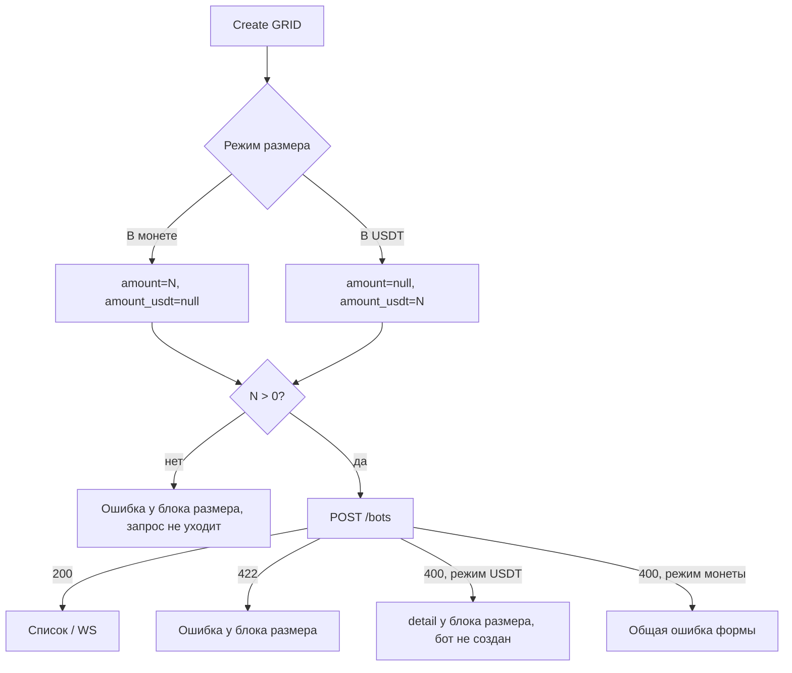

# Размер ордера сетки (GRID)

Страницы: `/bots/create` (создание, в том числе панель проверки ликвидации), карточка бота на `/bots` и `/bots/:id` (отображение).

Размер живёт в **`bot.config`** (`GRID_FUTURES`, Binance и OKX), не в настройках пользователя. Задать его можно двумя способами: количеством монеты или суммой в USDT. `ANTI_MARTINGALE_FUTURES` не затронут — там размер в процентах от баланса.

Новых эндпоинтов, WS-событий и миграций БД нет: меняется только `config`. Клиенты, которые шлют только `initial_amount`, работают как раньше. Take-profit и stop-loss от размера не зависят.

## Поля `config`

| Поле | Смысл | Ограничения |
|------|--------|-------------|
| `initial_amount` | Размер входа в монете (ETH для `ETHUSDT`) | `> 0` |
| `initial_amount_usdt` | **Номинал** входа в USDT (количество × цена), не маржа | `> 0` |

Правила:

- в запросе ровно одно из двух. Второе — `null` или не присылать. **Не** `0` и **не** `""`;
- оба поля, ни одного, `≤ 0` или не число → **422**;
- сумма меньше минимума биржи → **400**, бот не создан. Минимум заранее узнать нельзя (эндпоинта с лимитами символа нет), поэтому на фронте проверяется только `> 0`;
- у старых ботов ключа `initial_amount_usdt` может не быть;
- форма всегда шлёт оба ключа: выбранный со значением, второй `null`.

Что делает бэкенд с суммой: маржа = номинал / плечо; количество считается по цене каждого ордера и округляется **вниз** до шага биржи, ордер не превышает сумму; уровни растут по режиму объёма: вход = сумма, дальше ×2, ×3, … (linear) или ×2, ×4, … (exponential), в fixed все ордера на одну и ту же сумму.

UI: блок **«Размер ордера»** — переключатель **«В монете» / «В USDT»** и одно числовое поле, не два независимых инпута. Режим по умолчанию — «В монете». Подпись поля: «Размер входа, ETH» (монета берётся из `symbol`) или «Сумма входа, USDT». При переключении режима значение очищается. В режиме USDT под полем три подсказки (номинал, не маржа; округление вниз и минимум биржи; рост сумм по режиму объёма).

## Потоки

### Создание

1. Форма собирает полный `GridFuturesConfig`: один из ключей размера плюс TP и SL.
2. `POST /bots` `{ api_key_id, bot_type, config }`.
3. 200 → список / `bot_created`; ошибки — таблица ниже.

### Ошибки формы

| Когда | Что показываем |
|-------|----------------|
| Пусто, `≤ 0` или не число (до запроса) | «Укажите размер ордера больше нуля» у блока размера |
| **422**, в `loc` или `msg` есть `initial_amount` / `initial_amount_usdt` | сообщения API, относящиеся к размеру, у блока размера |
| **400** в режиме USDT | `detail` целиком у блока размера |
| **400** в режиме монеты | общий алерт формы, как раньше |

Блок размера стоит высоко в форме, поэтому при ошибке к нему прокручивается экран и фокус переходит в поле. Сообщение пропадает, когда значение или режим меняются.

Проверка размера идёт **раньше** проверок SL и TP: те ищут `stop_loss` / `take_profit` по всему `detail`, а 422 может вернуть отправленный `config` целиком, и тогда любая ошибка конфига выглядела бы как ошибка SL.

### Редактирование

Отдельной формы редактирования размера в интерфейсе нет. `PATCH /bots/{id}` не мержит поля, а модалки TP и SL берут текущий `bot.config` и отправляют его целиком. Поэтому конфиг в сторе приводится к одному заполненному полю размера, второе `null` (`normalizeBotConfig` в `useBots`): `0` или пустая строка в неиспользуемом поле на сервере не уйдут.

После `PATCH` со слишком малой суммой бот получит `bot_error` (`engine_error` показывается на карточке).

### Ликвидация

`POST /bots/check-liquidation` принимает тот же `config`. Панель проверки использует тот же блок размера (компактный вариант без подсказок) и общее с формой состояние: режим и значение синхронизированы.

### История создания

Список попыток `GET /bots/creation-history` показывает «Размер входа (монета)» или «Сумма входа (USDT)» по тому ключу, который был в запросе. «Скопировать настройки» восстанавливает режим и значение; записи, сделанные до появления `initial_amount_usdt`, открываются в режиме монеты.

## Список и WebSocket

Новых событий нет. Карточка GRID-бота читает размер из `bot.config`: `initial_amount_usdt` задан → «Вход 100 USDT», иначе `initial_amount` → «Вход 0.01 ETH». Значения `null`, `0` и пустая строка считаются «не задано».

## Код

| Часть | Путь |
|-------|------|
| Блок формы | `app/components/BotOrderSizeFields.vue` |
| Создание | `app/components/BotCreateForm.vue` |
| Проверка ликвидации | `app/components/BotLiquidationCheck.vue` |
| Карточка | `app/components/BotCard.vue` |
| Парсинг / payload / валидация / ошибки API | `app/utils/orderSize.ts` |
| Нормализация конфига для PATCH | `app/composables/useBots.ts` (`normalizeBotConfig`) |
| Клон из истории | `app/utils/parseBotCreatePayload.ts`, `app/utils/formatBotCreationSettings.ts` |
| Типы | `shared/types/bot.ts` (`GridFuturesConfig`, `OrderSizeMode`) |

Take-profit — отдельный блок, см. [`take-profit.md`](./take-profit.md).  
Stop-loss — отдельный блок, см. [`stop-loss.md`](./stop-loss.md).
