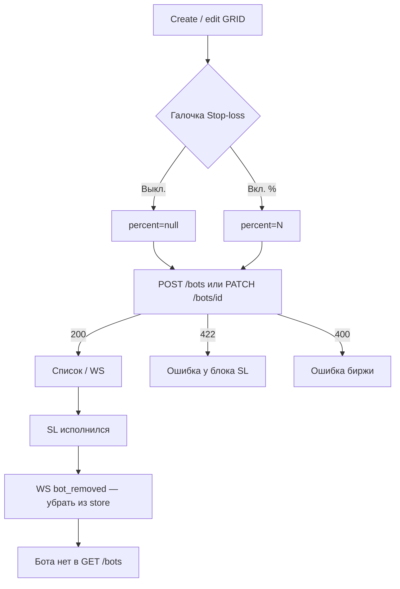

# Stop-loss сетки (GRID)

Страницы: `/bots/create` (создание), карточка на `/bots`, деталь `/bots/:id` (редактирование порога).

Поле живёт в **`bot.config`**, не в настройках пользователя. Это не take-profit и не Telegram-алерт прибыли (`telegram_profit_alert_*`): алерт прибыли пишет в чат по ROE/USDT, stop-loss ставит **reduce-only STOP_MARKET** на бирже (Binance / OKX). Если Telegram привязан, после SL придёт отдельное сообщение (уведомление `bot_removed`).

Фронт ордер сам не ставит — только конфиг. `POST /bots` и `PATCH /bots/{id}` всегда шлют `stop_loss_percent` (`null`, если выкл.). `PATCH` отправляет **весь** `config`, не одно поле:

```ts
await api.patch(`/bots/${id}`, {
  config: {
    ...bot.config,
    stop_loss_percent: slOn ? value : null,
  },
})
```

Take-profit и stop-loss независимы: можно включить оба, один или ни одного. Режима «сумма USDT» у SL нет. `auto_restart` на stop-loss **не действует**.

## Поля `config`

| Поле | Смысл | Выкл. | Ограничения |
|------|--------|--------|-------------|
| `stop_loss_percent` | Триггер SL = цена **последнего** ордера сетки ± N% (**не ROE / не плечо / не средний вход**) | `null` или `0` | `> 0` и `≤ 100` |

Правила:

- `null` / `0` / нет ключа → выкл., ордер на биржу не ставится;
- `> 0` → включён;
- бэкенд нормализует `0` → `null`. Старые боты без ключа = выкл., UI не падает;
- вместе с TP можно (это не 422).

UI: галочка **Stop-loss** рядом с Take-profit (два отдельных блока). После включения — одно числовое поле в процентах.

Подсказки в форме: стоп на бирже только после всех ордеров сетки; % от последнего уровня; LONG ниже / SHORT выше; после SL бот исчезает из списка, сетка не перезапускается; `auto_restart` не действует; если Telegram привязан — придёт сообщение.

## Потоки



### Создание

1. Форма собирает полный `GridFuturesConfig` вместе с TP и SL.
2. `POST /bots` `{ api_key_id, bot_type, config }`.
3. 200 → список / `bot_created`; 422 → подсветка блока SL (или TP, если XOR TP); 400 → бот не создан.

### Редактирование

`PATCH /bots/{id}` не мержит поля. Берётся текущий `bot.config`, подставляется SL, уходит целиком. TP не затирается.

### Ликвидация

`POST /bots/check-liquidation` принимает тот же `config`. На оценку ликвидации SL не влияет.

## Как работает ордер

1. Пока исполнены не все `grid_orders_count` уровней — стоп на бирже не ставится.
2. Когда сработали все уровни, движок ставит один reduce-only STOP_MARKET.
3. LONG: продажа ниже последнего ордера; SHORT: покупка выше.
4. Процент — от цены последнего уровня сетки. Пример: последний ордер 2000, `stop_loss_percent: 5` → около 1900 (LONG) или 2100 (SHORT).
5. Если SL исполнился: бот **исчезает из списка**, сетка **не** перезапускается. `auto_restart` здесь не применяется. Бота нет в `GET /bots` — не держать его как `CLOSED`.

## Список и WebSocket

`WS /ws?token=<access_jwt>`, канал `bots`, строка по `bot.id`.

| `event` | UI |
|---------|-----|
| `bot_updated` | PnL / `config` |
| `bot_closed` | статус **CLOSED**, строку **оставить** (take-profit / кнопка «Закрыть») |
| `bot_removed` | **удалить** бота из store (stop-loss или ручной DELETE) |
| `bot_config_updated` | после PATCH конфига |
| `bot_error` | `bot.engine_error` |

Критично не перепутать `bot_closed` и `bot_removed`. После SL не оставлять бота как CLOSED.

Пока бот жив, карточка читает порог из `bot.config`: «SL 5%» / «SL выкл.».

Если открыта `/bots/:id` и пришёл `bot_removed` по этому id — тост «Бот закрыт по stop-loss и убран из отслеживания» и редирект на `/bots`. `GET /bots/{id}` после этого не вызывать (фронт этот метод не использует).

История `GET /bots/history?bot_id=` после скрытия бота всё ещё доступна.

## История

Экран `/history`, см. [`history.md`](./history.md).

| `event_type` | Подпись |
|--------------|---------|
| `stop_loss_filled` | Stop-loss исполнен |
| `close_completed` + `reason: stop_loss` | Бот закрыт по stop-loss |
| `removed_from_tracking` + `reason: stop_loss` | Убран из отслеживания по stop-loss |
| `removed_from_tracking` без `reason: stop_loss` | Убран из отслеживания (ручной DELETE) |

`grid_recreated` после SL не будет.

## Код

| Часть | Путь |
|-------|------|
| Поля формы | `app/components/BotStopLossFields.vue` |
| Создание | `app/components/BotCreateForm.vue` |
| PATCH с карточки | `app/components/BotStopLossEditModal.vue` |
| Деталь | `app/pages/bots/[id].vue` |
| Парсинг / валидация | `app/utils/stopLoss.ts` |
| API / WS | `app/composables/useBots.ts` |
| Типы | `shared/types/bot.ts` (`GridFuturesConfig`) |

Take-profit — отдельный блок, см. [`take-profit.md`](./take-profit.md).  
Telegram — отдельный экран, см. [`../user/telegram-settings.md`](../user/telegram-settings.md).
