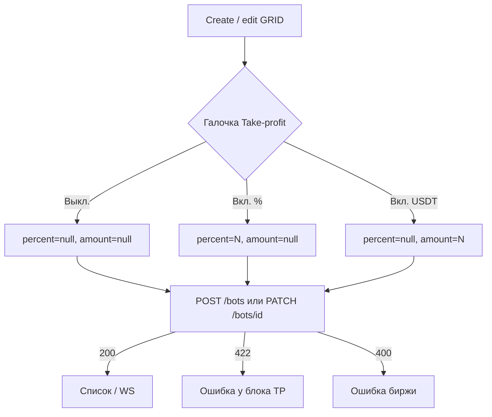

# Take-profit сетки (GRID)

Страницы: `/bots/create` (создание), карточка бота на `/bots` (редактирование порога).

Поля живут в **`bot.config`**, не в настройках пользователя. Это не Telegram-алерт (`telegram_profit_alert_*`): алерт только пишет в чат, take-profit ставит **reduce-only LIMIT** на бирже (Binance / OKX).

Фронт ордер сам не ставит — только конфиг. `POST /bots` и `PATCH /bots/{id}` всегда шлют оба ключа, второй = `null`. `PATCH` отправляет **весь** `config`, не одно поле.

## Поля `config`

| Поле | Смысл | Выкл. | Ограничения |
|------|--------|--------|-------------|
| `take_profit_percent` | Цена TP = средний вход ± N% (**не ROE / не плечо**) | `null` или `0` | `> 0` и `≤ 100` |
| `take_profit_amount` | Цена TP такая, чтобы нереализ. PnL ≈ N USDT | `null` или `0` | `> 0` |

Правила:

- оба `null` / `0` → выкл., ордер на биржу не ставится;
- ровно одно `> 0` → включён;
- оба `> 0` → **422** `Set only one of take_profit_percent or take_profit_amount`;
- бэкенд нормализует `0` → `null`. Старые боты без ключей = выкл.

UI: галочка **Take-profit** под автоперезапуском. После включения — одно числовое поле, единица в конце инпута (`%` по умолчанию, клик переключает на `USDT`). Не два независимых инпута (в отличие от Telegram-алерта).

## Потоки

### Создание

1. Форма собирает полный `GridFuturesConfig` вместе с TP.
2. `POST /bots` `{ api_key_id, bot_type, config }`.
3. 200 → список / `bot_created`; 422 → подсветка блока TP; 400 → бот не создан.

### Редактирование

`PATCH /bots/{id}` не мержит поля. Берётся текущий `bot.config`, подставляется TP, уходит целиком. После PATCH растёт `config_version`; UI ждёт ответ и/или `bot_config_updated`.

### Ликвидация

`POST /bots/check-liquidation` принимает тот же `config` (XOR тоже действует). На оценку ликвидации TP не влияет.

## Список и WebSocket

`WS /ws?token=<access_jwt>`, канал `bots`, строка по `bot.id`.

| `event` | UI |
|---------|-----|
| `bot_updated` | PnL / `config` |
| `bot_closed` | статус **CLOSED** — в т.ч. после take-profit |
| `bot_grid_redeployed` | при `auto_restart` после TP сетка пересоздаётся, бот **ACTIVE** |
| `bot_config_updated` | после PATCH конфига |
| `bot_error` | `bot.engine_error` |

Карточка читает порог из `bot.config`: «TP 10%» / «TP 25 USDT» / «TP выкл.».

## История (`GET /bots/history`)

Экран `/history`, см. [`history.md`](./history.md).

| `event_type` | Когда |
|--------------|--------|
| `take_profit_filled` | TP исполнился |
| `close_completed` | бот закрыт; при TP в `payload.reason` = `"take_profit"` |
| `grid_recreated` | авто-рестарт сетки после TP |

Подписи: «Take-profit исполнен» / «Бот закрыт по take-profit».

## Код

| Часть | Путь |
|-------|------|
| Поля формы | `app/components/BotTakeProfitFields.vue` |
| Создание | `app/components/BotCreateForm.vue` |
| PATCH с карточки | `app/components/BotTakeProfitEditModal.vue` |
| Парсинг / XOR | `app/utils/takeProfit.ts` |
| API | `app/composables/useBots.ts` (`createBot`, `updateBotConfig`) |
| Типы | `shared/types/bot.ts` (`GridFuturesConfig`) |

Telegram-алерт — отдельный экран, см. [`../user/telegram-settings.md`](../user/telegram-settings.md).
