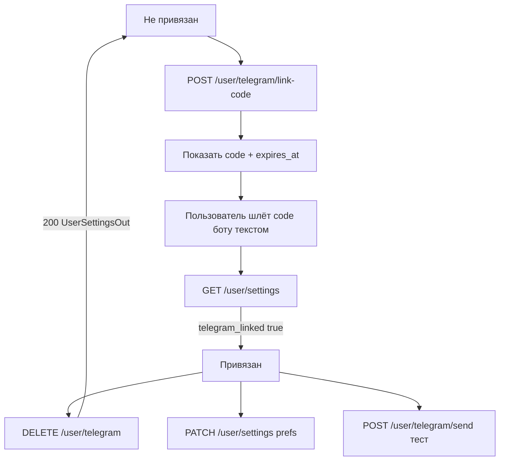

# Telegram: привязка и уведомления

Страница: `/settings` (карточка `SettingsTelegramCard`).

Источник правды по состоянию — `GET /user/settings` (`useUserSettings`).

## Поля UI

| Поле | Смысл |
|------|--------|
| `telegram_linked` | чат привязан (`telegram_chat_id` на бэке) |
| `telegram_notifications_enabled` | мастер-переключатель |
| `telegram_notifications` | список `{ id, label, enabled }` для свитчей |
| `telegram_notification_prefs` | те же флаги объектом |

Кнопка «Отвязать» видна только при `telegram_linked === true`.  
Выключение уведомлений ≠ отвязка.

## Потоки

### Привязка

1. `POST /user/telegram/link-code` → `{ code, expires_at }`
2. Пользователь отправляет `code` боту сообщением
3. «Проверить привязку» → `GET /user/settings`

Повторный `link-code` инвалидирует предыдущий код.

### Отвязка

`DELETE /user/telegram` → `200` с телом как у settings (`telegram_linked: false`).  
Store обновляется из ответа без лишнего GET.

`400` — уже не привязан (`detail`: «Telegram не привязан.»).

Prefs и мастер-флаг **не** сбрасываются.

### Уведомления

`PATCH /user/settings` — частичное обновление (`telegram_notifications_enabled`, `telegram_notification_prefs`).

### Тест

`POST /user/telegram/send` `{ "message": "..." }`  
Нужны `telegram_linked` и `TELEGRAM_BOT_TOKEN` на сервере.

## Код

| Часть | Путь |
|-------|------|
| UI | `app/components/SettingsTelegramCard.vue` |
| API/store | `app/composables/useUserSettings.ts` |
| Типы | `shared/types/user-settings.ts` |
| Страница | `app/pages/settings/index.vue` |
