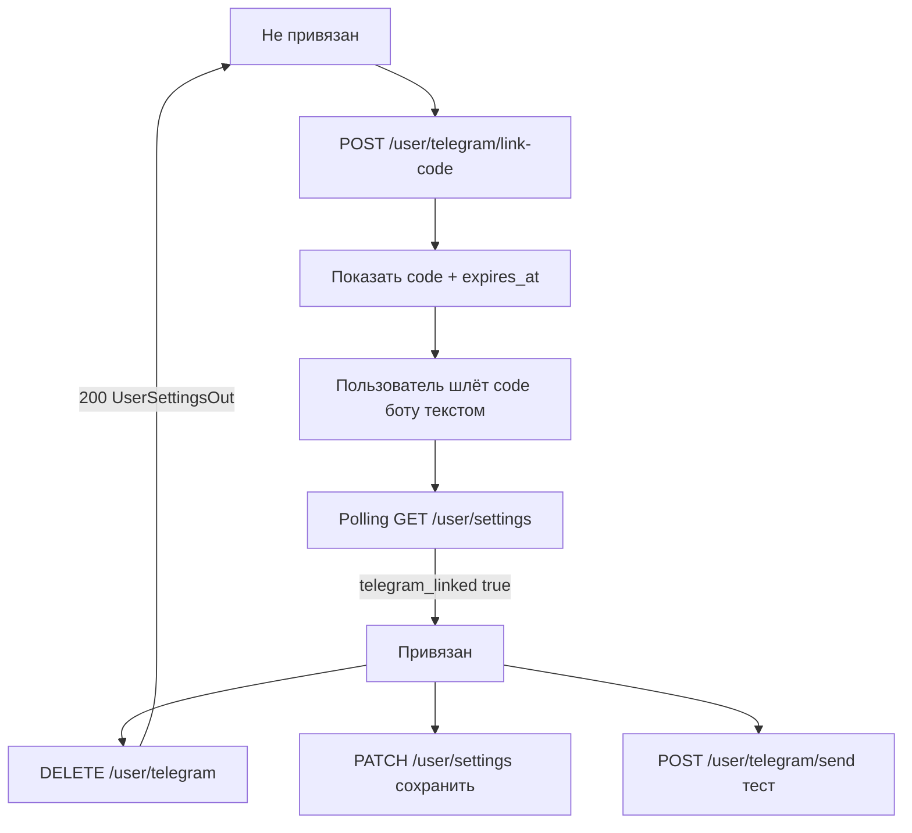

# Telegram: привязка и уведомления

Страница: `/settings` (карточка `SettingsTelegramCard`).

Источник правды по состоянию — `GET /user/settings` (`useUserSettings`).  
После любого `PATCH` / `DELETE` store заменяется телом ответа (`UserSettingsOut`).

## Поля UI

| Поле | Смысл |
|------|--------|
| `telegram_linked` | чат привязан |
| `telegram_notifications_enabled` | мастер-переключатель |
| `telegram_notifications` | список `{ id, label, enabled }` для свитчей (включая `profit_alert`) |
| `telegram_notification_prefs` | те же флаги объектом (удобно для PATCH одного ключа) |
| `telegram_profit_alert_percent` | порог ROE %; `null` / `0` = выкл. |
| `telegram_profit_alert_usd` | порог нереализ. PnL USDT; `null` / `0` = выкл. |

Кнопка «Отвязать» видна только при `telegram_linked === true`.  
Выключение уведомлений ≠ отвязка. Prefs и пороги после отвязки **сохраняются**.

## Потоки

### Привязка

1. `POST /user/telegram/link-code` → `{ code, expires_at }`
2. Пользователь отправляет `code` боту сообщением
3. UI polling `GET /user/settings` (~3 с, до 3 мин) + кнопка «Проверить привязку»

Повторный `link-code` инвалидирует предыдущий код.

### Отвязка

`DELETE /user/telegram` → `200` с телом как у settings (`telegram_linked: false`).  
Store обновляется из ответа без лишнего GET.

`400` — уже не привязан.

### Уведомления

Кнопка «Сохранить настройки Telegram» → `PATCH /user/settings` с мастером, prefs и порогами `%` / `USDT`.

Чекбоксы рендерятся из `telegram_notifications` (без хардкода id).  
При `master === false` чекбоксы и пороги дизейблятся.

### Алерт прибыли

Блок порогов показывается под пунктом `id === 'profit_alert'`.

- Достаточно одного активного порога (OR на бэке).
- Оба выкл. → сообщений нет, даже при `profit_alert: true`.
- Инпуты дизейблятся, если нет привязки / мастер выкл. / чекбокс `profit_alert` выкл.
- Фронт **не** шлёт алерт сам — только настройки; живой PnL из `GET /bots` / WS.

Не путать с take-profit сетки: пороги алерта живут в `/user/settings` (OR, только сообщение в чат, % = ROE). Автозакрытие позиции — поля `take_profit_*` в конфиге бота, см. [`../bots/take-profit.md`](../bots/take-profit.md).

### Тест

`POST /user/telegram/send` `{ "message": "..." }`  
`400` — не привязан; `503` — нет токена бота / очередь.

## Код

| Часть | Путь |
|-------|------|
| UI | `app/components/SettingsTelegramCard.vue` |
| API/store | `app/composables/useUserSettings.ts` |
| Типы | `shared/types/user-settings.ts` |
| Страница | `app/pages/settings/index.vue` |
